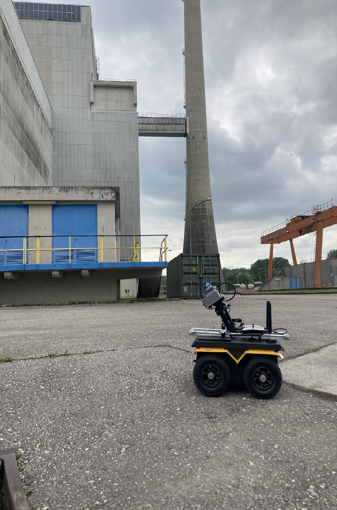
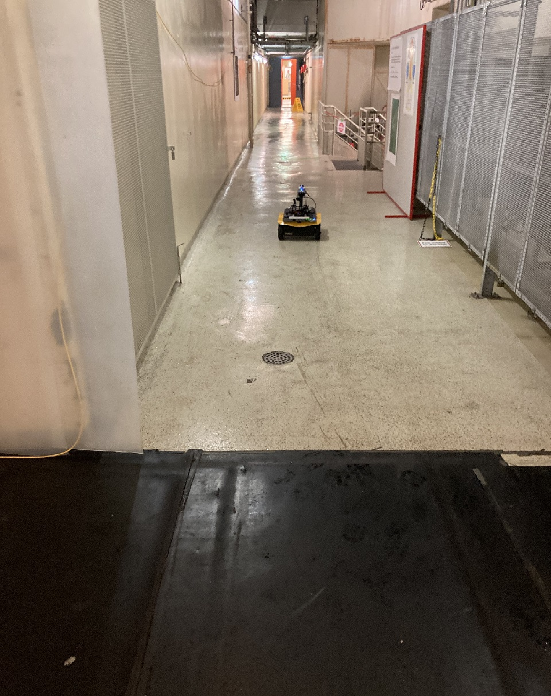
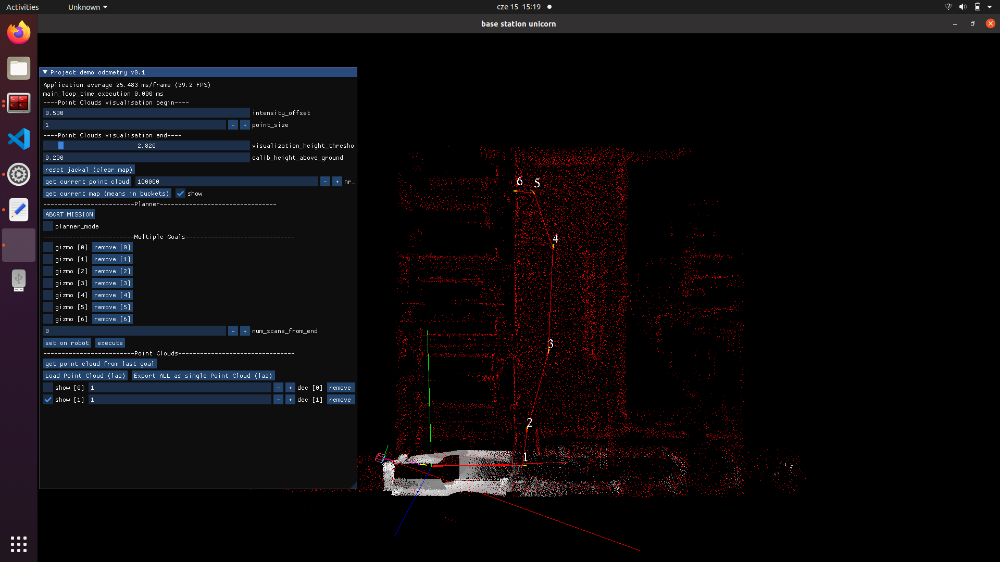

This is an end-to-end open-source software for nuclear power plant inspection with mobile robot.
If You have any question please send info to januszbedkowski@gmail.com or add issue to this repository. 






-----

# base station program
https://github.com/JanuszBedkowski/msas_enrich_2023/blob/master/src/mandeye_unicorn/src/base_station_unicorn.cpp

# robot program
https://github.com/JanuszBedkowski/msas_enrich_2023/blob/master/src/mandeye_unicorn/src/mandeye_unicorn_imu.cpp

# run commands
on robot
```
screen -S mandeye
cd ~/msas_enrich_2023/devel/lib/mandeye_unicorn
./mandeye_unicorn_imu ./mid360_config_lio.json 0 /mnt/usb/ ~/enrich2023_data/
```

on base station
```
cd ~/msas_enrich_2023/devel/lib/mandeye_unicorn/
./base_station_unicorn
```

# setting up jackal
 - install ubuntu 16.04
 - install ros-kinetic bare bone

# create workspace 

```
mkdir -p catkin_ws/src
cd catkin_ws/src

git clone https://github.com/JanuszBedkowski/enrich2019.git
git submodule init --recursive

sudo apt-get install ros-kinetic-controller-manager ros-kinetic-diagnostic-* ros-kinetic-nmea-* libpcap-dev ros-kinetic-realtime-tools ros-kinetic-roslint ros-kinetic-rosserial-server ros-kinetic-teleop-twist-* ros-kinetic-xacro ros-kinetetic-lms1xx ros-kinetic-pointgrey-camera-description ros-kinetic-interactive-marker-twist-server ros-kinetic-twist-mux ros-kinetic-robot-localization ros-kinetic-imu-filter-madgwick ros-kinetic-diff-drive-controller ros-kinetic-joint-state-controller ros-kinetic-*-fkie ros-kinetic-opencv3 ros-kinetic-image-transport ros-kinetic-camera-info-manager ros-kinetic-cv-bridge ros-kinetic-pcl-ros ros-kinetic-tf-conversions ros-kinetic-angles ros-kinetic-velodyne-description
```

Make not needed packages ignored:
```
touch ~/catkin_ws/src/enrich2019/src/mandala_piap_unit_driver/mandala_ladybug/CATKIN_IGNORE
touch ~/catkin_ws/src/enrich2019/src/mandala_piap_unit_driver/mandala_unit_color_pc/CATKIN_IGNORE
touch ~/catkin_ws/src/enrich2019/src/mandala_piap_unit_driver/mandala_laserscan_2_cloud/CATKIN_IGNORE
```

```
catkin_make
```

# setup joystick

```
wget https://packages.clearpathrobotics.com/public.key -O - | sudo apt-key add -
sudo sh -c 'echo "deb https://packages.clearpathrobotics.com/stable/ubuntu $(lsb_release -cs) main" > /etc/apt/sources.list.d/clearpath-latest.list'
sudo apt-get update
sudo apt-get install python-ds4drv
sudo ds4drv-pair
```


# network interfaces

set `/etc/network/interfaces`
```
# The loopback network interface
auto lo
iface lo inet loopback

# The primary network interface
auto eno1
iface eno1 inet static
address 192.168.0.6
netmask 255.255.255.0
gateway 192.168.0.1
dns-nameservers 8.8.8.8 8.8.4.4

auto enp3s0
iface enp3s0 inet static
    address 192.168.1.100
    netmask 255.255.255.0
    gateway 0.0.0.0

```

 - Create `/etc/network/if-up.d/script`
```
#!/bin/bash
# to install script copy it  to
# sudo cp script /etc/network/if-up.d/
# sudo chmod 755 /etc/network/if-up.d/script
route add -net 224.0.0.0 netmask 224.0.0.0 dev enp2s0
```

 - Install `/etc/udev/rules.d`

```
sudo cp enrich2019/config/etc/rules.d/*.rules /etc/udev/rules.d

```


